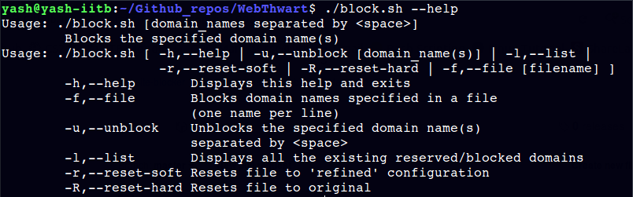

# WebThwart
## Website-blocking tool for Ubuntu
* * *
### Overview
WebThwart is a terminal based utility for Ubuntu and other similar Linux distros that aids in blocking, managing and unblocking websites for better productivity and a distract-free online experience.

Based on the (safe) exploitation of `/etc/hosts` system-config file, WebThwart provides the following features :<br>
 
* * *
### Installation
Download the repository as a `.zip` file and then extract it, or clone it using the command
``` 
git clone https://github.com/ys1998/WebThwart.git
```
Change permissions of the `block.sh` file :
```
cd WebThwart/
chmod 755 block.sh
```
The `block.sh` script can be used as such by invoking it with `./block.sh`. For using it as a normal terminal command, follow these steps :
```
sudo cp block.sh /usr/bin/
```
The script can now be invoked with `block` only.
* * *
### Usage
The script can be currently used in the following manner :
* Display help menu
``` 
block [-h OR --help]
```
* Block specified websites 
```
block [domain_names of website(s) separated by <SPACE>]
```
* Block domain names present in a file (one per line)
```
block [-f OR --file] <file_name>
```
* Unblock specified domain names
```
block [-u OR --unblock] [domain_names separated by <SPACE>]
```
* List all reserved/blocked domain names
```
block [-l OR --list]
```
* Reset 
	* Reset to refined configuration
	```
	block [-r OR --reset-soft]
	```
	* Reset to original configuration
	```
	block [-R OR --reset-hard]
	```
* * *
### Screenshots
<br>
<br>
<br>
* * *
### TODO
* Add password-protected unblocking feature
* Implement blocking of domains for specified time interval


